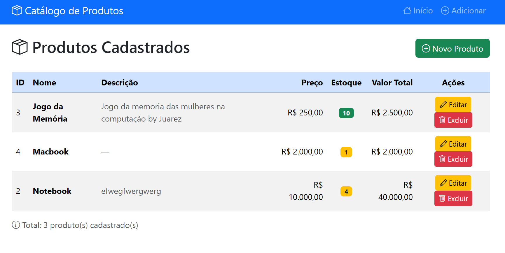
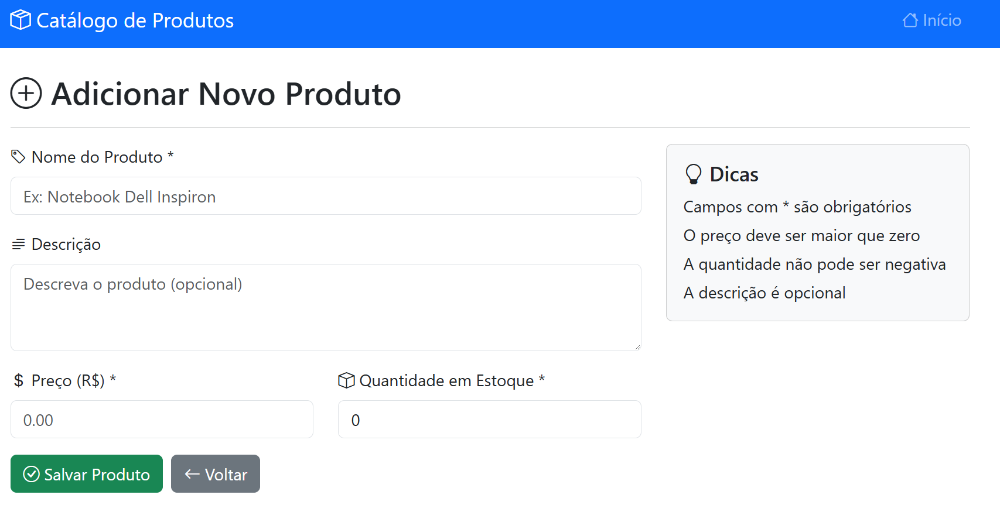

# SGC - Sistema de Gestão de Catálogo

> Sistema web para gerenciamento de catálogo de produtos de e-commerce, desenvolvido com Python e Flask.

##  Descrição

O SGC é um sistema web completo para gestão de catálogo de produtos. Permite cadastrar, listar, editar e excluir produtos de uma loja virtual, com interface moderna e responsiva.

**Desenvolvido como projeto final do curso de Python para Web.**

##  Funcionalidades

- [x] Cadastro de produtos (nome, preço, descrição, categoria)
- [x] Listagem de todos os produtos
- [x] Edição de produtos existentes
- [x] Exclusão de produtos com confirmação
- [ ] Validação de dados no formulário
- [x] Tratamento de erros com mensagens amigáveis
- [ ] Interface responsiva com Bootstrap 5
- [x] Persistência de dados com SQLite

## Tecnologias Utilizadas

| Tecnologia | Versão | Uso |
|-----------|--------|-----|
| Python | 3.10+ | Linguagem principal |
| Flask | 3.0 | Framework web |
| SQLAlchemy | 2.0+ | ORM (acesso ao banco) |
| SQLite | 3 | Banco de dados |
| Bootstrap | 5.3 | Interface visual |
| Jinja2 | 3.1+ | Templates HTML |

## Como Executar

### Pré-requisitos

- Python 3.10 ou superior instalado
- pip (gerenciador de pacotes Python)

### Passo a Passo

```bash
# 1. Clone ou baixe o projeto
git clone <url-do-repositorio>
cd sgc

# 2. (Opcional) Crie um ambiente virtual
python -m venv venv
source venv/bin/activate  # Linux/Mac
# venv\Scripts\activate   # Windows

# 3. Instale as dependências
pip install -r requirements.txt

# 4. Execute o servidor
python app.py

# 5. Acesse no navegador
# http://localhost:5000
```

## Estrutura do Projeto

```
sgc/
├── app.py              # Aplicação principal (rotas Flask)
├── models.py           # Modelos do banco de dados (Produto)
├── database.py         # Configuração do SQLAlchemy
├── requirements.txt    # Dependências do projeto
├── README.md           # Este arquivo
├── .gitignore          # Arquivos ignorados pelo Git
├── static/
│   └── css/
│       └── style.css   # Estilos personalizados
└── templates/
    ├── base.html       # Template base (layout)
    ├── index.html      # Página inicial (listagem)
    ├── criar.html      # Formulário de cadastro
    └── editar.html     # Formulário de edição
```

##  Screenshots

> Em Andamento





##  Testes

```bash
# Executar testes (se implementados)
python -m pytest tests/
```

##  Licença

Projeto desenvolvido para fins educacionais.

##  Autor

**Professor - Caio**
- Local: Senac Gravataí
- Turma: TIN19
- Curso: Python para Desenvolvimento Web
- Ano: 2026


---

> Desenvolvido como projeto durante o decorrer das aulas do curso de Python para Web
